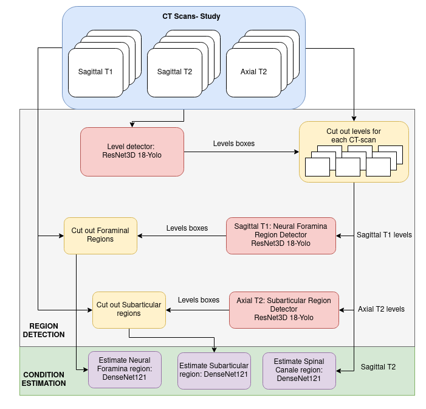
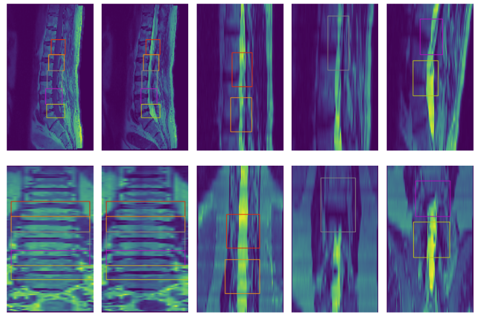
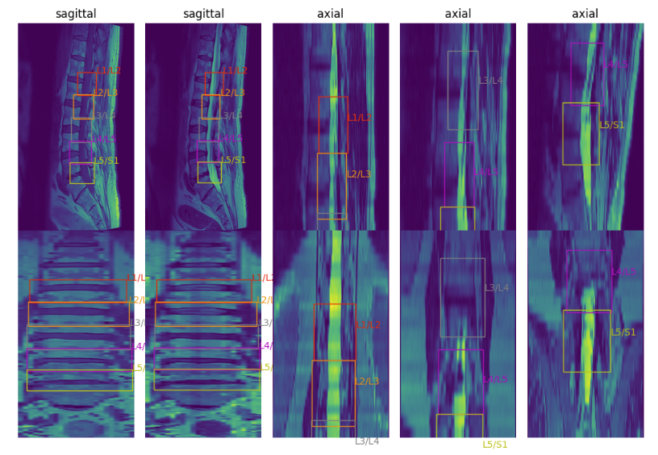
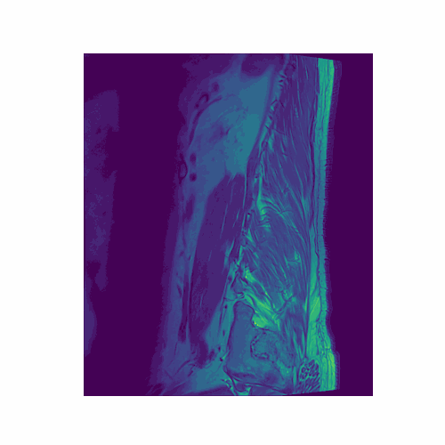
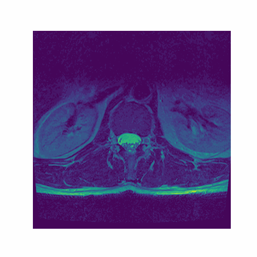

## 3D Object Detection on CT Scans: A ResNet3D-YOLO Approach

**Project Overview**

This project explores the potential of utilizing ResNet3D as a feature extractor and YOLO as a detection head for 3D object detection on CT scans. The primary objective is to develop a robust and efficient model capable of accurately identifying and localizing objects within CT scan images.

**Feature Extraction**

* **ResNet3D Architecture:** The project employs the ResNet3D architecture, a deep neural network specifically designed for 3D data. This architecture has demonstrated exceptional performance in various computer vision tasks.
* **Pre-trained Weights:** To accelerate the training process and enhance model performance, pre-trained weights provided by Tencent/MedicalNet [1] were utilized.
* **Feature Extraction:** The ResNet3D model was modified to extract features from each stage of the network, providing a rich representation of the input CT scan data.

**Alternative Architectures**

While ResNet3D was the chosen architecture, other architectures provided by Timm3d [2] were considered as an alternatives. However, ResNet3D was ultimately selected due to its small size, faster inference speed and smaller reduction on image dimensions. Performance comparison between different architectures was not conducted.

**Detection Head**

* **YOLO Algorithm:** The YOLOv7 algorithm, adapted from the YOLOv9 implementation [3], was employed as the detection head for the model.
* **3D Convolution:** The original classification and detection heads were modified to use 3D convolution, enabling the model to process 3D input data.
* **Functions:** The YOLO algorithm was modified to handle 3D bounding boxes. Additionally, the aspect ratio component of the CIoU loss was computed as the mean of the aspect ratios of the height-width and height-depth dimensions.  
  
**Schema of implemented model:**

## Data

**Dataset:** The RSNA 2024 Lumbar Spine Degenerative Classification dataset from Kaggle was utilized for training and testing the models. This dataset consists of CT scans in three modalities: sagittal T1, sagittal T2, and axial T2. The scans are annotated with points corresponding to lumbar spine conditions at various levels (L1/L2 to L5/S1).

**Data Preprocessing:**

* **Bounding Box Generation:** Based on the annotated points, bounding boxes were generated for each level, assuming that the box should encompass the entire region associated with the condition.
* **Condition-Specific Bounding Boxes:** For the final pipeline, additional bounding boxes were drawn around specific conditions to enable more precise condition detection.

Further details regarding the data preprocessing steps can be found in the "data_preprocessing" folder.

## Final Pipeline

The final pipeline was designed to accomplish the following:

1. **Level Detection:** For each CT scan, the pipeline identifies the relevant spinal levels.
2. **Level Extraction:** The detected levels are extracted from the original CT scan, creating individual level-specific images.
3. **Condition Detection:** The extracted level images are processed to detect regions of specific conditions.
4. **Condition Classification:** The regions of interest corresponding to detected conditions are extracted and classified using a pre-trained DenseNet121 model (Timm implementation [4]).  
  

  
Code for the final pipeline is contained inside "detect_estimate_mednet_yolo.ipynb" 

## Results

**Level Detection**

A Mean Average Precision (mAP@50) of 0.92 was achieved for level detection using a ResNet3D-18 backbone and pre-trained weights from MedicalNet.

**Ground truth:**  
  
**Predicted levels:**

  
**Foramina and Subarticular Region Detection**

An mAP@50 of 0.88 was achieved for foramina region detection, while subarticular region detection reached an mAP@50 of 0.81.

**Example of Foramina and Subarticular Region Detection:**
Foraminal region detection          |  Subarticular region detection
:-------------------------:|:-------------------------:
|  